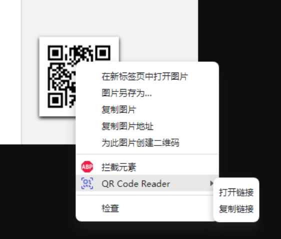

# [二维码识别器]

## 简介

这是一个简单易用的浏览器插件，可以帮助用户快速识别网页上的二维码，并提供多种操作方式。

## 功能

- 识别网页上的二维码
- 提供多种操作方式，包括“在新标签页中打开链接”和“复制链接到粘贴板”等
- 
  
## 安装

1. 打开Chrome浏览器，进入扩展程序页面（chrome://extensions/）。
2. 在本地目录找到本插件"QrcodeImage.crx"并安装至Chrome浏览器。
3. 安装完成后，本插件会出现在Chrome浏览器的扩展程序列表中。

## 使用方法

1. 在浏览器中打开需要识别二维码的网页。
2. 将鼠标移动到二维码图片上右击，会出现一个提示框，提示用户可以使用插件来识别该二维码。
3. 点击提示框中的“QR Code Reader”按钮。
4. 插件会自动识别该二维码，并在右键菜单中提供多种操作方式，包括“打开链接”和“复制链接”。
5. 用户可以根据自己的需求选择相应的操作方式。

## 开发者信息

- 作者：清语
- 联系方式：
- 

## 免责声明

本项目仅供学习和研究使用，不得用于商业目的。任何因使用本项目造成的后果，作者不承担任何责任。使用本项目涉及到的所有风险和损失，由使用者自行承担。

请在使用本项目前仔细阅读本免责声明，并确保您已经理解并同意其中的所有内容。
